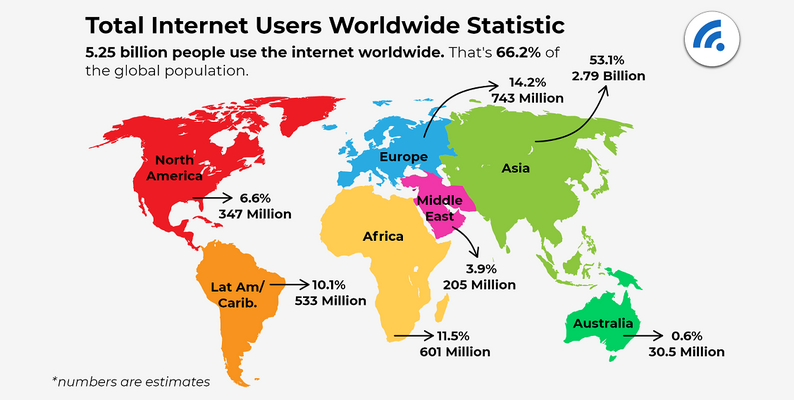

# Global Internet Usage

---

### About Dataset
Link: https://www.kaggle.com/datasets/sansuthi/gapminder-internet

GapMinder collects data from a handful of sources, including the Institute for Health Metrics and Evaluation, the US Census Bureau’s International Database, the United Nations Statistics Division, and the World Bank.

### Variable Name & Description of Indicator:
  - `country`: Unique Identifier

  - `incomeperperson`: Gross Domestic Product per capita in constant 2000 US$. The inflation but not the differences in the cost of living between countries has been taken into account.

  - `internetuserate`: Internet users (per 100 people). Internet users are people with access to the worldwide network.

  - `urbanrate`: Urban population (% of total) Urban population refers to people living in urban areas as defined by national statistical offices (calculated using World Bank population estimates and urban ratios from the United Nations World Urbanization Prospects)

More information is available at www.gapminder.org.

--- 
Todo:
  - Finding and downloading a data set. (DONE)
  - Exploratory Data Analysis. (DONE)
  - Coming up with an interesting story to tell using that data (and figuring out who your audience is to tell it to). The story should help us learn how the world works, or provide actionable recommendations that the chosen audience can use. (In-Progress)
  - Developing a data dashboard. (In-Progress - published)
  - Developing a memo. (In-Progress)
  - Doing a presentation of your data, story, and dashboard. (In-progress)  $${\color{green}Green}$$	$${\color{green}In-progress}$$

**Dashboard:** https://jlei8.shinyapps.io/dashboard/
